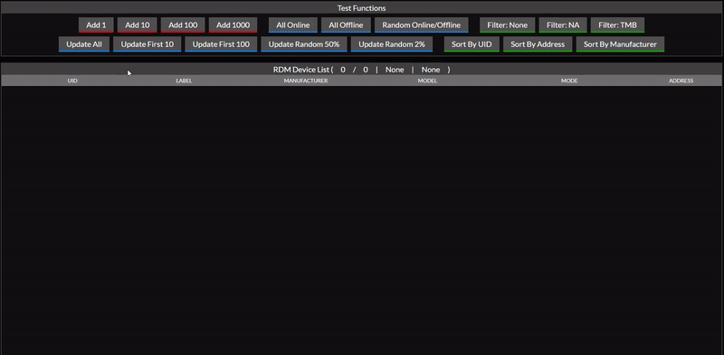

# Demo of the app

## Description

This is a list of devices. You can add and update devices in the table. The available data in the table can also be sorted and filtered, and certain fields can be manually modified. It was exciting to try my skills and not use any frameworks for this project. Because of the large amount of data that can be added, it was challenging and fun to see directly how much the performance changes with each change and added feature.

## Technology used

- Typescript
- HTML
- CSS

## Running project

1. To start run these in the root folder (in shown order)
- `npm update` 
- `npm run start`

 
## What to do in the future

1. Add loading element when it's loading.
3. Try to rebuild the project using frameworks.
